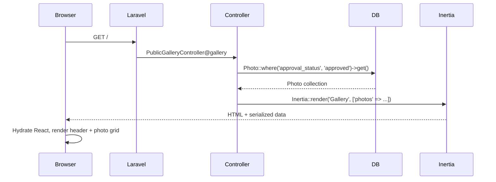
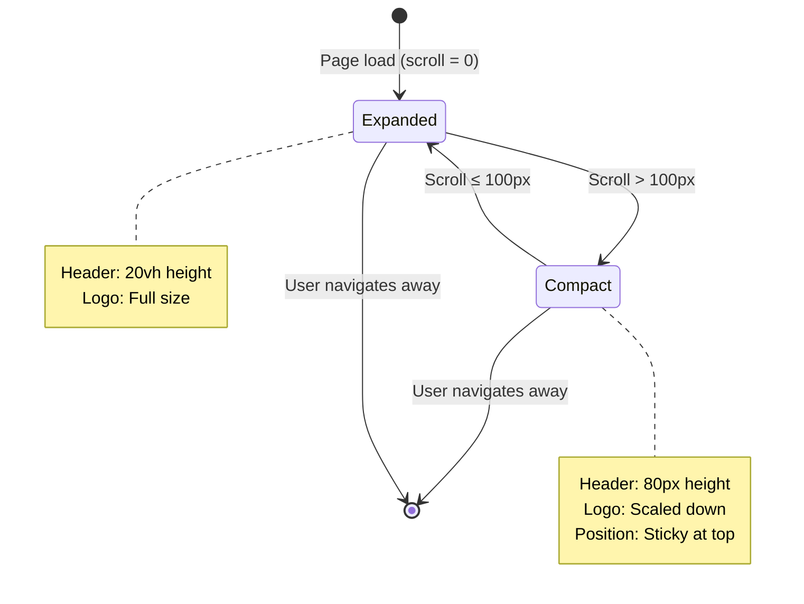
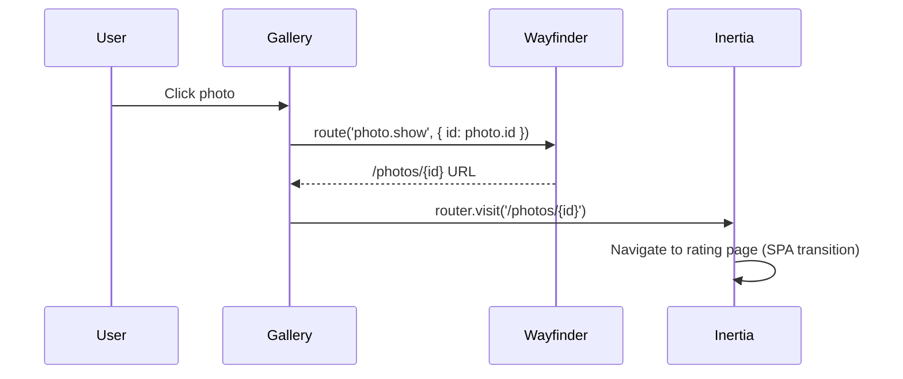

# Data Model

**Feature**: Dynamic Header with Photo Gallery Landing Page
**Date**: 2025-11-16
**Status**: Phase 1 Design

## Overview

This document defines the data entities, structures, and relationships required for the dynamic header and photo gallery landing page. The feature primarily consumes existing data from `PublicGalleryController` without requiring new database entities.

---

## Entities

### 1. Photo (Existing Entity)

**Source**: Existing `Photo` model (assumed from `PublicGalleryController` in FR-009)

**Description**: Represents a contest photo entry submitted by users. Photos have approval status and are displayed on the public gallery when approved.

**Attributes**:

| Field | Type | Nullable | Description | Validation |
|-------|------|----------|-------------|------------|
| `id` | integer | No | Primary key | Auto-increment |
| `title` | string | No | Photo title/caption | Max 255 chars |
| `url` | string | No | File path or URL to photo | Valid image path |
| `photographer_name` | string | Yes | Name of photographer | Max 255 chars |
| `upload_date` | timestamp | No | When photo was uploaded | Valid datetime |
| `approval_status` | enum | No | 'pending', 'approved', 'rejected' | One of enum values |
| `created_at` | timestamp | No | Record creation time | Auto-managed |
| `updated_at` | timestamp | No | Record update time | Auto-managed |

**Relationships**:
- None required for this feature (photos displayed independently)

**Business Rules**:
- Only photos with `approval_status = 'approved'` are displayed in public gallery (FR-008)
- Photos maintain original aspect ratios when displayed (FR-022)
- Photos are clickable and navigate to rating page (FR-021)

**Queries**:
```php
// Fetch approved photos for gallery (from PublicGalleryController)
Photo::where('approval_status', 'approved')
     ->orderBy('upload_date', 'desc')
     ->get();
```

---

### 2. Header State (Client-Side State)

**Source**: React component state (not persisted)

**Description**: Represents the current visual state of the dynamic header based on scroll position.

**Attributes**:

| Field | Type | Description |
|-------|------|-------------|
| `isCompact` | boolean | `true` when scrolled past 100px threshold, `false` otherwise |
| `scrollPosition` | number | Current vertical scroll position in pixels |

**State Transitions**:
```
Initial State (scrollPosition = 0):
  isCompact = false (header at 20vh height)

Scroll Down (scrollPosition > 100):
  isCompact = true (header transitions to 80px height over 350ms)

Scroll Up (scrollPosition ≤ 100):
  isCompact = false (header expands back to 20vh over 350ms)
```

**Implementation**: Managed by `useScrollPosition` custom hook

---

### 3. Navigation Menu (Static Configuration)

**Source**: Hard-coded configuration (no database)

**Description**: Defines the structure of the navigation menu items displayed in the burger menu.

**Structure**:
```typescript
interface MenuItem {
  label: string;      // Display text
  route: string;      // Wayfinder route name
  icon?: React.ReactNode; // Optional icon (future)
}

const menuItems: MenuItem[] = [
  { label: 'Gallery', route: 'gallery' },    // FR-004
  { label: 'Upload', route: 'upload' },      // FR-004
  { label: 'Login', route: 'login' },        // FR-004
  { label: 'Impressum', route: 'impressum' }, // FR-004
];
```

**Business Rules**:
- Exactly 4 menu items in the specified order (FR-004)
- Menu closes after item selection (FR-006)
- All items keyboard accessible (FR-018)

---

### 4. Theme Appearance (Client-Side State)

**Source**: Existing `use-appearance` hook (cookie-persisted)

**Description**: Represents user's theme preference (light, dark, or system).

**Attributes**:

| Field | Type | Description |
|-------|------|-------------|
| `appearance` | 'light' \| 'dark' \| 'system' | Current theme mode |
| `systemPreference` | 'light' \| 'dark' | Detected OS theme preference |
| `resolvedTheme` | 'light' \| 'dark' | Actual applied theme |

**Persistence**: Cookie (survives page refreshes and navigation)

**Business Rules**:
- Respects system preference when `appearance = 'system'` (FR-017)
- All colors maintain 4.5:1 contrast ratio in both modes (SC-006)

---

## Data Flow

### Landing Page Load



### Header Scroll Behavior



### Photo Click Navigation



---

## TypeScript Interfaces

### Frontend Props

```typescript
// resources/js/Pages/Gallery.tsx
interface GalleryPageProps {
  photos: Photo[];
}

interface Photo {
  id: number;
  title: string;
  url: string;
  photographer_name: string | null;
  upload_date: string; // ISO 8601 timestamp
  approval_status: 'approved'; // Only approved photos sent to frontend
}

// resources/js/components/public-header.tsx
interface PublicHeaderProps {
  isCompact?: boolean; // Controlled mode (optional)
  logoUrl?: string;    // Logo image URL
}

// resources/js/components/photo-grid.tsx
interface PhotoGridProps {
  photos: Photo[];
  columns?: {
    mobile: number;   // Default: 1
    tablet: number;   // Default: 3
    desktop: number;  // Default: 4
  };
}

// resources/js/hooks/use-scroll-position.ts
interface UseScrollPositionResult {
  isScrolled: boolean;
  scrollPosition: number;
}
```

---

## Validation Rules

### Photo Entity (Backend)

```php
// Example validation (if creating/updating photos - not in this feature)
[
    'title' => 'required|string|max:255',
    'url' => 'required|string|max:2048',
    'photographer_name' => 'nullable|string|max:255',
    'upload_date' => 'required|date',
    'approval_status' => 'required|in:pending,approved,rejected',
]
```

### Photo Props (Frontend TypeScript)

```typescript
// Runtime validation using Zod (if needed)
import { z } from 'zod';

const PhotoSchema = z.object({
  id: z.number().int().positive(),
  title: z.string().max(255),
  url: z.string().url(),
  photographer_name: z.string().max(255).nullable(),
  upload_date: z.string().datetime(),
  approval_status: z.literal('approved'),
});

type Photo = z.infer<typeof PhotoSchema>;
```

---

## Performance Considerations

### Data Loading Strategy

1. **Eager Loading**: Header and page metadata load immediately
2. **Deferred Loading**: Photo collection loads asynchronously via Inertia deferred props
3. **Lazy Images**: Below-the-fold photos use `loading="lazy"` attribute
4. **Caching**: Consider query caching for approved photos (refresh every 5 minutes)

```php
// PublicGalleryController.php - with caching
public function gallery()
{
    $photos = Cache::remember('approved_photos', 300, function () {
        return Photo::where('approval_status', 'approved')
                    ->orderBy('upload_date', 'desc')
                    ->get();
    });

    return Inertia::render('Gallery', [
        'photos' => Inertia::defer(fn () => $photos),
    ]);
}
```

### Database Indexes

```sql
-- Index for fast approved photo queries
CREATE INDEX idx_approval_status_upload_date
ON photos (approval_status, upload_date DESC);
```

---

## Edge Cases

### Empty State

**Scenario**: No approved photos in database
**Data**: `photos = []`
**UI**: Display empty state message ("No photos available yet. Check back soon!")

### Large Photo Collections

**Scenario**: 100+ approved photos
**Data**: All photos loaded (no pagination in MVP)
**Performance**: Lazy loading prevents performance degradation
**Future**: Consider virtual scrolling or pagination

### Photo URL Validation

**Scenario**: Photo URL is invalid or image doesn't exist
**Handling**:
- Backend: Validate URL on photo upload (separate feature)
- Frontend: Provide fallback image or error placeholder
- Test: Ensure broken images don't break layout

---

## Summary

This data model defines:
- **1 database entity**: Photo (existing, queried only)
- **3 client-side states**: Header state, navigation menu, theme appearance
- **0 new database migrations**: Feature uses existing infrastructure
- **Type-safe interfaces**: All data structures typed for TypeScript

Next: Generate API contracts and quickstart guide.
